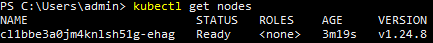
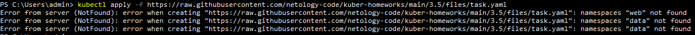

# Домашнее задание к занятию Troubleshooting

Kubernetes кластер поднят:  
  
Попытка применения [kubernetes manifest файла](https://raw.githubusercontent.com/netology-code/kuber-homeworks/main/3.5/files/task.yaml):  
  
Как можно понять из вывода в kubernetes кластере отсутствуют неймспейсы "web" и "data".  
Неймспейсы созданы:  
  
[Kubernetes manifest файл](https://raw.githubusercontent.com/netology-code/kuber-homeworks/main/3.5/files/task.yaml) успешно применен:  
  
Поды успещно запущены и не падают в ошибку:  
  
Но по заданию ошибка быть должна, поэтому пошёл смотреть логи подов.  
В auth-db ошибок не найдено:  
  
В web-consumer найдена ошибка связанная с невозможностью определить ip адрес имени "auth-db":  
  
Это связанно с тем что web-consumer создан в namespace web, а сервис с именем auth-db и поды к которым он предоставляет доступ находятся в namespace data:  
  
Исправить это можно двумя способами, либо перенести сервис и поды auth-db в namespace web, либо добавить к искомому в web-consumer имя namespace в котором находится нужный сервис.  
Я предполагаю что разделение web-consumer и auth-db по разным namespace является частью архитектуры проекта, поэтому считаю более правильным идти по второму пути.  
Редактируем деплоймент web-consumer:  
  
  
Поды пересоздались и команда curl внутри web-consumer теперь успешно отрабатывает:  
